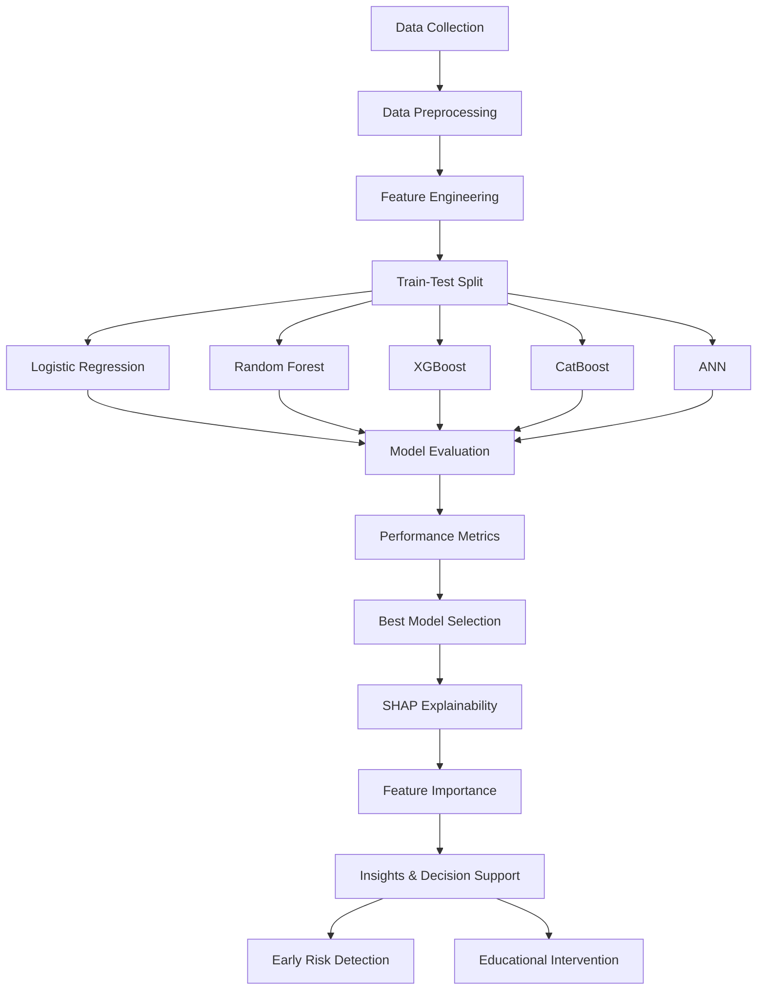

# Den-SOFA: Dental Student Outcome Forecasting Assistant

## Overview

Den-SOFA is an Explainable Machine Learning (XAI) framework designed to predict academic outcomes in dental education. It focuses on both predictive performance and interpretability, enabling early identification of at-risk students and supporting data-driven educational interventions.

This project integrates multiple machine learning models with SHAP-based explainability to analyze complex, nonlinear relationships between academic, demographic, and performance-related variables.

---

## Key Features

* Predicts **Pass/Fail outcomes** and **Multiclass grades (A–F)**
* Supports multiple ML models:

  * Logistic Regression
  * Random Forest
  * XGBoost
  * CatBoost
  * Artificial Neural Networks (ANN)
* Explainability using **SHAP (SHapley Additive exPlanations)**
* Identifies key predictors such as:

  * Cumulative GPA
  * Academic term
  * Phantom lab performance
  * Theoretical course grades
* Minimal bias from demographic variables

---

## Dataset

* Sample size: **90 dental students**
* Features: **26 variables**, including:

  * Academic performance metrics
  * Practical and theoretical grades
  * Academic progression indicators
  * Demographic information

---

## Methods

1. Data preprocessing and cleaning
2. Feature selection and engineering
3. Model training using multiple algorithms
4. Performance evaluation using:

   * Accuracy
   * F1-score
   * AUC-ROC
   * MCC (Matthews Correlation Coefficient)
   * Sensitivity & Specificity
5. Model interpretation using SHAP

---

## Results Summary

### Binary Classification (Pass/Fail)

* **ANN**:

  * AUC-ROC: 0.906
  * Accuracy: 0.86
  * MCC: 0.71

* **Random Forest**:

  * AUC-ROC: 0.864
  * Accuracy: 0.86
  * More interpretable

### Multiclass Classification (A–F)

* Best AUC-ROC: 0.775
* Moderate predictive performance

---

## Explainability Insights (SHAP)

Top predictors:

* Academic term
* Cumulative GPA
* Phantom laboratory scores
* Theoretical grades

Low impact:

* Demographic variables

---

## Project Structure

```
Den-SOFA/
│── data/
│── notebooks/
│── models/
│── src/
│   ├── preprocessing.py
│   ├── training.py
│   ├── evaluation.py
│   ├── explainability.py
│── results/
│── README.md
```

---

## Installation

```bash
git clone https://github.com/your-repo/den-sofa.git
cd den-sofa
pip install -r requirements.txt
```

---

## Usage

```bash
python src/training.py
python src/evaluation.py
```

---

## Flowchart



---

## Applications

* Early identification of at-risk students
* Personalized learning strategies
* Curriculum optimization
* Academic performance monitoring

---

## Future Work

* Integration with real-time academic dashboards
* Expansion to other medical education domains
* Deployment as a web-based decision support system

---

## Keywords

Artificial Intelligence, Machine Learning, Explainable AI, Educational Data Mining, Dental Education

---

## License

MIT License
